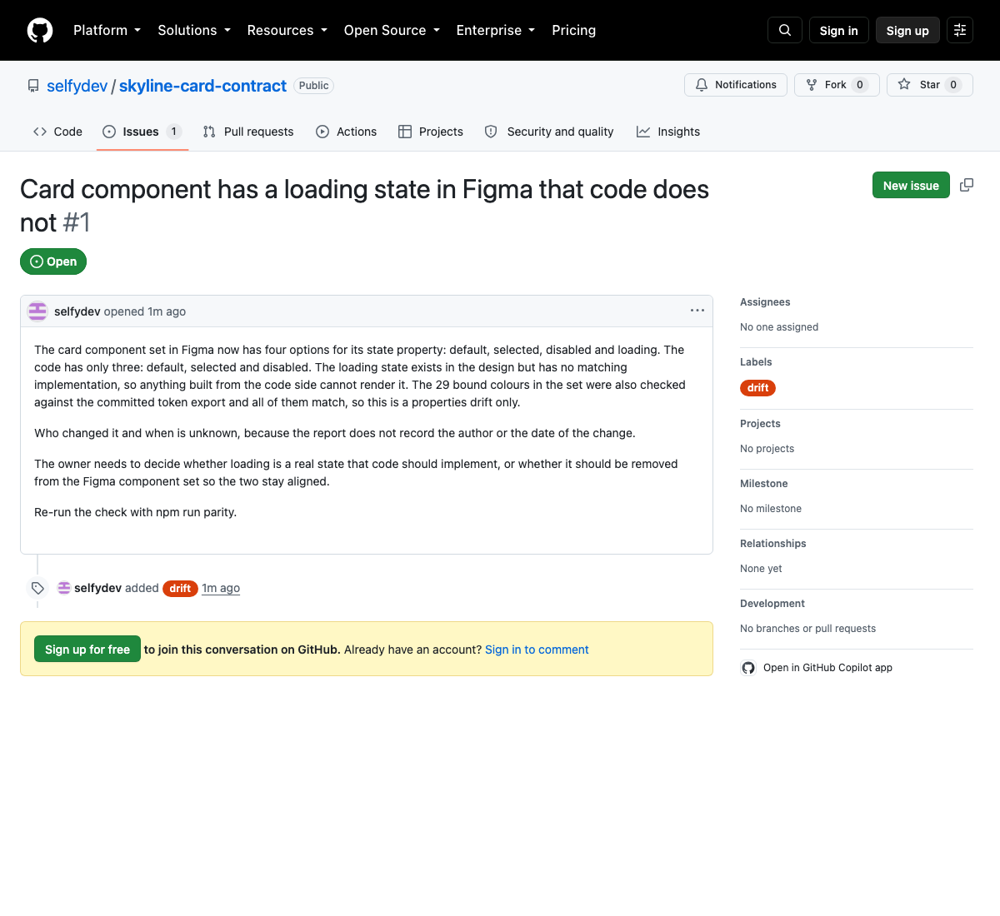

# Skyline card contract

One airline card component, and the machinery that keeps its Figma file and its code honest with each other.

Built as part of a design system task. The Figma file is the source for tokens and component properties. This repo holds the code side of the contract and a check that runs weekly.

## What is here

- `tokens/` DTCG JSON exported from the Figma variable collections and text styles by `scripts/figma/export-tokens.js`, which runs inside Figma. Names are identical to Figma: `background/card` in Figma is `background.card` here and `--background-card` in CSS. Aliases are resolved to values at build time.
- `src/components/AddOnCard/` the component. Props mirror the Figma properties. Direction sets `dir` and the stylesheet uses logical properties, so there is no RTL stylesheet.
- `AddOnCard.figma.tsx` the Code Connect mapping. Validated with `figma connect parse`. Publishing needs an Organisation plan, which this draft file does not have, so Dev Mode on the draft still shows Figma's generated code rather than this.
- `scripts/parity/` the check. Pulls the component set from the REST API, compares properties and options with the code contract, compares bound colours with the token export, prints a report, exits 1 on drift.
- `.github/workflows/parity.yml` runs it every Monday. On drift it opens an issue. With an Anthropic key present the issue is written by Claude from the report; without one it posts the raw report.
- `index.html` renders every variant in a grid. There is no Storybook. The contract is the tokens, the props and the check, not a rendering surface.

## Why it is shaped like this

The scenario: designers detached instead of requesting, engineering said built components no longer matched Figma, and nobody could say which version was right. The file bore that out. Ten component sets, ten variants named after frame numbers, thirteen hardcoded fills, and on the screens page twelve card instances reaching a selected look by overriding the border instead of switching a variant, because the variant they needed did not exist.

A report that says exactly what drifted, where, and when is the cheapest thing that makes "which version is right" a question with an answer. The AI part sits on top of a deterministic diff. It writes the issue a person would otherwise write on a Friday. It never decides what is correct.

## Run it

```
cp .env.example .env   # fill in token, file key, set id
npm ci
npm run tokens
npm test
npm run parity
npm run dev
```

## Known limits

- Figma's Variables REST endpoint is Enterprise only. On lower plans the parity check compares bound colours by value against the committed export, which catches a changed value but not a renamed token. The export script in `scripts/figma/export-variables.js` runs inside Figma and is the source of `tokens/` until that endpoint is available.
- One component. The shape scales by adding a props file per component and a set id per line in the workflow.
- Text styles are exported but not checked by the parity script. Variables and component properties are. Extending the check to styles is a small addition once the file is on a plan with the styles endpoint.


